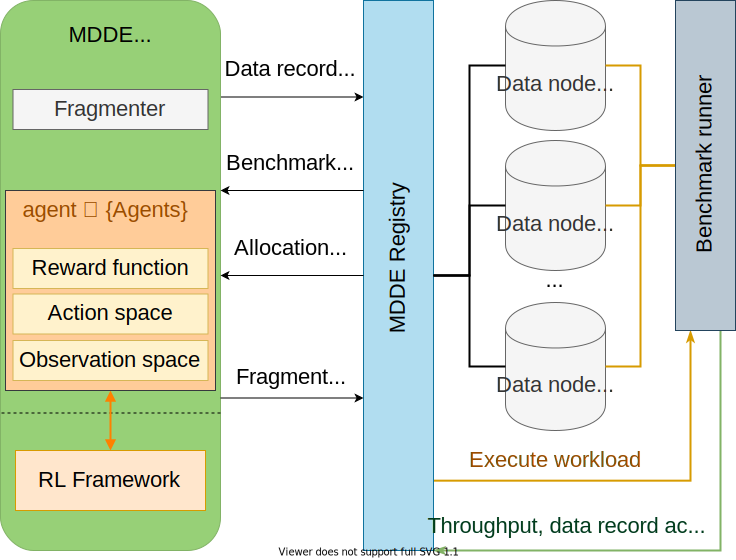

<!-- omit in toc -->
# Multi-agent Data Distribution Environment (MDDE)

MDDE is developed to facilitate the application of the reinforcement learning (RL) algorithms for the optimization of data distribution within a distributed data storage.
The project is designed to represent a real-world data storage system instead of relying on cost models, which might not always be accurate. 

The current implementation of MDDE focuses on read-oriented scenarios.

- [Structure](#structure)
  - [Registry](#registry)
  - [Environment](#environment)
- [Development](#development)
- [Deployment](#deployment)
- [Additional repositories](#additional-repositories)
  - [MAAC plugin](#maac-plugin)
  - [Tools](#tools)

## Structure

 

### Registry
`./registry`

Since the goal is the creation of an environment for assessment and design of reinforcement learning algorithms, abstraction from existing database engines and the extensive heuristic optimization and distribution algorithms, which are built-in most of these, was one of the priorities. Additionally, an RL algorithm must have fine-grained control over the distribution and replication of data records. In order o satisfy these requirements, a simple distributed data orchestration module is provided: [Registry](https://github.com/akharitonov/mdde/tree/master/registry). 

### Environment
`./mdde` 

One of the primary goals in development was the simplification of integration with RL frameworks or algorithm implementation,
while at the same time maintaining a high level of extensibility and accessibility for the researchers in the field. Therefore, the core [environment](https://github.com/akharitonov/mdde/tree/master/mdde) is written in Python and responsible for forming fragments, processing, and transforming action and observation spaces. This environment communicates with the registry via TCP connection and can be deployed separately from it and data nodes.

## Development

...

## Deployment

`./docker`

...

## Additional repositories

### MAAC plugin

We provide a wrapper around [Actor-Attention-Critic for Multi-Agent Reinforcement Learning](https://github.com/shariqiqbal2810/MAAC).
You can find the plugin and code samples in the repo: [mdde-MAAC](https://github.com/akharitonov/mdde-MAAC).

### Tools

Any additional samples and supporting utilities, such as a processor of the history of the observation, are published in the [mdde-toolbox](https://github.com/akharitonov/mdde-toolbox) repository.